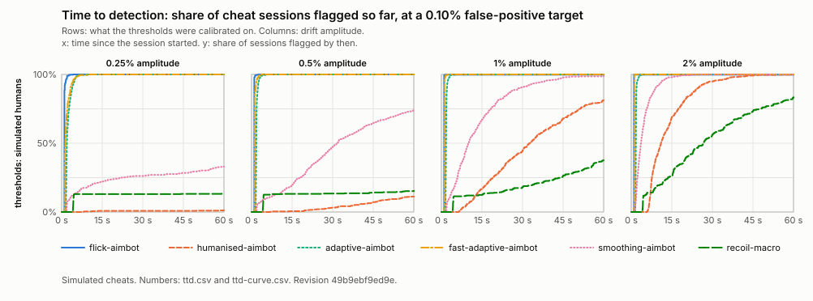
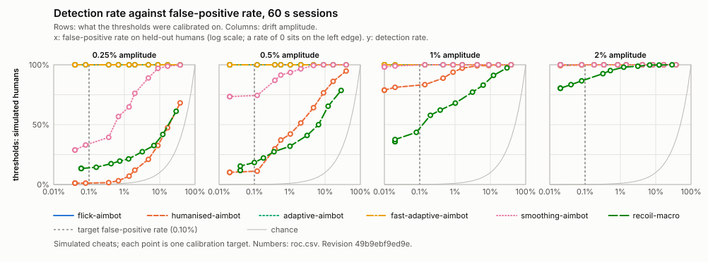

# Detector evaluation (task 1.12)

Written by `cargo xtask eval`; rerun it instead of editing this file. Revision `49b9ebf9ed9e056b23947e67897c88a74cfb715b`.

> **No human sessions were given.** Every threshold and every false-positive rate below comes from simulated humans, whose model is not fitted to real players. Nothing here is evidence about people.

Detection rates and false-positive rates are per session of 60 s, at thresholds calibrated for a false-positive rate of 0.10%. Intervals are 95% Wilson score intervals. A false-positive rate is only ever measured on sessions that played no part in setting the thresholds.

## Sessions

| Source | Used for | Amplitude | Scenario | Class | Sessions | People |
|---|---|---|---|---|---:|---:|
| simulator | calibration | 0.25% | flick | human | 5000 | - |
| simulator | calibration | 0.25% | spray | human | 5000 | - |
| simulator | calibration | 0.5% | flick | human | 5000 | - |
| simulator | calibration | 0.5% | spray | human | 5000 | - |
| simulator | calibration | 1% | flick | human | 5000 | - |
| simulator | calibration | 1% | spray | human | 5000 | - |
| simulator | calibration | 2% | flick | human | 5000 | - |
| simulator | calibration | 2% | spray | human | 5000 | - |
| simulator | cheat | 0.25% | flick | adaptive-aimbot | 500 | - |
| simulator | cheat | 0.25% | flick | fast-adaptive-aimbot | 500 | - |
| simulator | cheat | 0.25% | flick | flick-aimbot | 500 | - |
| simulator | cheat | 0.25% | flick | humanised-aimbot | 500 | - |
| simulator | cheat | 0.25% | flick | smoothing-aimbot | 500 | - |
| simulator | cheat | 0.25% | spray | recoil-macro | 500 | - |
| simulator | cheat | 0.5% | flick | adaptive-aimbot | 500 | - |
| simulator | cheat | 0.5% | flick | fast-adaptive-aimbot | 500 | - |
| simulator | cheat | 0.5% | flick | flick-aimbot | 500 | - |
| simulator | cheat | 0.5% | flick | humanised-aimbot | 500 | - |
| simulator | cheat | 0.5% | flick | smoothing-aimbot | 500 | - |
| simulator | cheat | 0.5% | spray | recoil-macro | 500 | - |
| simulator | cheat | 1% | flick | adaptive-aimbot | 500 | - |
| simulator | cheat | 1% | flick | fast-adaptive-aimbot | 500 | - |
| simulator | cheat | 1% | flick | flick-aimbot | 500 | - |
| simulator | cheat | 1% | flick | humanised-aimbot | 500 | - |
| simulator | cheat | 1% | flick | smoothing-aimbot | 500 | - |
| simulator | cheat | 1% | spray | recoil-macro | 500 | - |
| simulator | cheat | 2% | flick | adaptive-aimbot | 500 | - |
| simulator | cheat | 2% | flick | fast-adaptive-aimbot | 500 | - |
| simulator | cheat | 2% | flick | flick-aimbot | 500 | - |
| simulator | cheat | 2% | flick | humanised-aimbot | 500 | - |
| simulator | cheat | 2% | flick | smoothing-aimbot | 500 | - |
| simulator | cheat | 2% | spray | recoil-macro | 500 | - |
| simulator | evaluation | 0.25% | flick | human | 5000 | - |
| simulator | evaluation | 0.25% | spray | human | 5000 | - |
| simulator | evaluation | 0.5% | flick | human | 5000 | - |
| simulator | evaluation | 0.5% | spray | human | 5000 | - |
| simulator | evaluation | 1% | flick | human | 5000 | - |
| simulator | evaluation | 1% | spray | human | 5000 | - |
| simulator | evaluation | 2% | flick | human | 5000 | - |
| simulator | evaluation | 2% | spray | human | 5000 | - |

## Thresholds, per scenario

A session is flagged when a statistic's session score goes above its threshold. With n calibration sessions no false-positive rate below 1/n can be told from zero: when 1/n is above the target, the threshold is just the highest score seen, and the target is not met by calibration alone. "off": no calibration session scored on that statistic, so it has no threshold and never flags.

| Calibrated on | Amplitude | Scenario | Sessions | People | Smallest resolvable rate | Thresholds |
|---|---|---|---:|---:|---:|---|
| simulated humans | 0.25% | flick | 5000 | - | 0.02% | error 10.190, steps 4.733, change 10.351 |
| simulated humans | 0.25% | spray | 5000 | - | 0.02% | error 6.948, steps off, spray 15.141 |
| simulated humans | 0.5% | flick | 5000 | - | 0.02% | error 11.872, steps 4.586, change 7.228 |
| simulated humans | 0.5% | spray | 5000 | - | 0.02% | error 7.034, steps off, spray 15.638 |
| simulated humans | 1% | flick | 5000 | - | 0.02% | error 8.339, steps 4.788, change 7.276 |
| simulated humans | 1% | spray | 5000 | - | 0.02% | error 6.663, steps off, spray 15.350 |
| simulated humans | 2% | flick | 5000 | - | 0.02% | error 7.190, steps 4.163, change 5.028 |
| simulated humans | 2% | spray | 5000 | - | 0.02% | error 5.936, steps off, spray 15.142 |

Full precision, and the matching `rearguard-server` settings (one threshold set per scenario): `thresholds.csv`, `thresholds.json`.

## False-positive and detection rates

### Thresholds calibrated on simulated humans

| Amplitude | Scenario | Who | What | Flagged | Rate [95% Wilson] |
|---|---|---|---|---:|---|
| 0.25% | flick | simulated humans, calibration set | calibration check (not a measurement) | 3/5000 | 0.06% |
| 0.25% | flick | simulated humans, held out | false-positive rate (held out) | 4/5000 | 0.08% [0.03%, 0.21%] |
| 0.25% | flick | adaptive-aimbot (simulated) | detection rate | 500/500 | 100% [99.2%, 100%] |
| 0.25% | flick | fast-adaptive-aimbot (simulated) | detection rate | 500/500 | 100% [99.2%, 100%] |
| 0.25% | flick | flick-aimbot (simulated) | detection rate | 500/500 | 100% [99.2%, 100%] |
| 0.25% | flick | humanised-aimbot (simulated) | detection rate | 6/500 | 1.2% [0.55%, 2.6%] |
| 0.25% | flick | smoothing-aimbot (simulated) | detection rate | 165/500 | 33.0% [29.0%, 37.2%] |
| 0.25% | spray | simulated humans, calibration set | calibration check (not a measurement) | 2/5000 | 0.04% |
| 0.25% | spray | simulated humans, held out | false-positive rate (held out) | 3/5000 | 0.06% [0.02%, 0.18%] |
| 0.25% | spray | recoil-macro (simulated) | detection rate | 67/500 | 13.4% [10.7%, 16.7%] |
| 0.5% | flick | simulated humans, calibration set | calibration check (not a measurement) | 3/5000 | 0.06% |
| 0.5% | flick | simulated humans, held out | false-positive rate (held out) | 6/5000 | 0.12% [0.06%, 0.26%] |
| 0.5% | flick | adaptive-aimbot (simulated) | detection rate | 500/500 | 100% [99.2%, 100%] |
| 0.5% | flick | fast-adaptive-aimbot (simulated) | detection rate | 500/500 | 100% [99.2%, 100%] |
| 0.5% | flick | flick-aimbot (simulated) | detection rate | 500/500 | 100% [99.2%, 100%] |
| 0.5% | flick | humanised-aimbot (simulated) | detection rate | 56/500 | 11.2% [8.7%, 14.3%] |
| 0.5% | flick | smoothing-aimbot (simulated) | detection rate | 372/500 | 74.4% [70.4%, 78.0%] |
| 0.5% | spray | simulated humans, calibration set | calibration check (not a measurement) | 2/5000 | 0.04% |
| 0.5% | spray | simulated humans, held out | false-positive rate (held out) | 2/5000 | 0.04% [0.01%, 0.15%] |
| 0.5% | spray | recoil-macro (simulated) | detection rate | 77/500 | 15.4% [12.5%, 18.8%] |
| 1% | flick | simulated humans, calibration set | calibration check (not a measurement) | 3/5000 | 0.06% |
| 1% | flick | simulated humans, held out | false-positive rate (held out) | 1/5000 | 0.02% [0.00%, 0.11%] |
| 1% | flick | adaptive-aimbot (simulated) | detection rate | 500/500 | 100% [99.2%, 100%] |
| 1% | flick | fast-adaptive-aimbot (simulated) | detection rate | 500/500 | 100% [99.2%, 100%] |
| 1% | flick | flick-aimbot (simulated) | detection rate | 500/500 | 100% [99.2%, 100%] |
| 1% | flick | humanised-aimbot (simulated) | detection rate | 406/500 | 81.2% [77.5%, 84.4%] |
| 1% | flick | smoothing-aimbot (simulated) | detection rate | 495/500 | 99.0% [97.7%, 99.6%] |
| 1% | spray | simulated humans, calibration set | calibration check (not a measurement) | 2/5000 | 0.04% |
| 1% | spray | simulated humans, held out | false-positive rate (held out) | 1/5000 | 0.02% [0.00%, 0.11%] |
| 1% | spray | recoil-macro (simulated) | detection rate | 188/500 | 37.6% [33.5%, 41.9%] |
| 2% | flick | simulated humans, calibration set | calibration check (not a measurement) | 3/5000 | 0.06% |
| 2% | flick | simulated humans, held out | false-positive rate (held out) | 4/5000 | 0.08% [0.03%, 0.21%] |
| 2% | flick | adaptive-aimbot (simulated) | detection rate | 500/500 | 100% [99.2%, 100%] |
| 2% | flick | fast-adaptive-aimbot (simulated) | detection rate | 500/500 | 100% [99.2%, 100%] |
| 2% | flick | flick-aimbot (simulated) | detection rate | 500/500 | 100% [99.2%, 100%] |
| 2% | flick | humanised-aimbot (simulated) | detection rate | 499/500 | 99.8% [98.9%, 100.0%] |
| 2% | flick | smoothing-aimbot (simulated) | detection rate | 500/500 | 100% [99.2%, 100%] |
| 2% | spray | simulated humans, calibration set | calibration check (not a measurement) | 2/5000 | 0.04% |
| 2% | spray | simulated humans, held out | false-positive rate (held out) | 2/5000 | 0.04% [0.01%, 0.15%] |
| 2% | spray | recoil-macro (simulated) | detection rate | 417/500 | 83.4% [79.9%, 86.4%] |

## By drift amplitude

### Thresholds calibrated on simulated humans

| What | Who | Scenario | 0.25% | 0.5% | 1% | 2% |
|---|---|---|---|---|---|---|
| false-positive rate (held out) | simulated humans, held out | flick | 0.08% [0.03%, 0.21%] | 0.12% [0.06%, 0.26%] | 0.02% [0.00%, 0.11%] | 0.08% [0.03%, 0.21%] |
| false-positive rate (held out) | simulated humans, held out | spray | 0.06% [0.02%, 0.18%] | 0.04% [0.01%, 0.15%] | 0.02% [0.00%, 0.11%] | 0.04% [0.01%, 0.15%] |
| detection rate | adaptive-aimbot (simulated) | flick | 100% [99.2%, 100%] | 100% [99.2%, 100%] | 100% [99.2%, 100%] | 100% [99.2%, 100%] |
| detection rate | fast-adaptive-aimbot (simulated) | flick | 100% [99.2%, 100%] | 100% [99.2%, 100%] | 100% [99.2%, 100%] | 100% [99.2%, 100%] |
| detection rate | flick-aimbot (simulated) | flick | 100% [99.2%, 100%] | 100% [99.2%, 100%] | 100% [99.2%, 100%] | 100% [99.2%, 100%] |
| detection rate | humanised-aimbot (simulated) | flick | 1.2% [0.55%, 2.6%] | 11.2% [8.7%, 14.3%] | 81.2% [77.5%, 84.4%] | 99.8% [98.9%, 100.0%] |
| detection rate | smoothing-aimbot (simulated) | flick | 33.0% [29.0%, 37.2%] | 74.4% [70.4%, 78.0%] | 99.0% [97.7%, 99.6%] | 100% [99.2%, 100%] |
| detection rate | recoil-macro (simulated) | spray | 13.4% [10.7%, 16.7%] | 15.4% [12.5%, 18.8%] | 37.6% [33.5%, 41.9%] | 83.4% [79.9%, 86.4%] |

## Time to detection

Seconds from the start of a session to its first flag, for the cheat sessions flagged within 60 s. The plot shows the whole distribution: the share of sessions flagged so far.



| Thresholds from | Amplitude | Cheat | Source | Flagged | 10% | Median | 90% | Median shots | Median engagements |
|---|---|---|---|---:|---:|---:|---:|---:|---:|
| simulated humans | 0.25% | adaptive-aimbot | simulator | 500/500 | 1.6 s | 1.9 s | 3.9 s | 12 | 12 |
| simulated humans | 0.25% | fast-adaptive-aimbot | simulator | 500/500 | 1.1 s | 1.4 s | 3.3 s | 13 | 13 |
| simulated humans | 0.25% | flick-aimbot | simulator | 500/500 | 1.0 s | 1.0 s | 1.1 s | 10 | 10 |
| simulated humans | 0.25% | humanised-aimbot | simulator | 6/500 | 8.4 s | 13.3 s | 58.7 s | 19 | 19 |
| simulated humans | 0.25% | smoothing-aimbot | simulator | 165/500 | 1.9 s | 7.1 s | 50.6 s | 37 | 37 |
| simulated humans | 0.25% | recoil-macro | simulator | 67/500 | 4.2 s | 4.3 s | 4.4 s | 33 | 2 |
| simulated humans | 0.5% | adaptive-aimbot | simulator | 500/500 | 1.6 s | 1.7 s | 2.3 s | 11 | 11 |
| simulated humans | 0.5% | fast-adaptive-aimbot | simulator | 500/500 | 1.1 s | 1.1 s | 1.5 s | 11 | 11 |
| simulated humans | 0.5% | flick-aimbot | simulator | 500/500 | 1.0 s | 1.0 s | 1.0 s | 10 | 10 |
| simulated humans | 0.5% | humanised-aimbot | simulator | 56/500 | 20.3 s | 40.0 s | 55.4 s | 59 | 59 |
| simulated humans | 0.5% | smoothing-aimbot | simulator | 372/500 | 3.5 s | 24.4 s | 47.8 s | 129 | 130 |
| simulated humans | 0.5% | recoil-macro | simulator | 77/500 | 4.2 s | 4.3 s | 34.4 s | 33 | 2 |
| simulated humans | 1% | adaptive-aimbot | simulator | 500/500 | 1.5 s | 1.7 s | 2.1 s | 11 | 11 |
| simulated humans | 1% | fast-adaptive-aimbot | simulator | 500/500 | 1.1 s | 1.1 s | 1.1 s | 11 | 11 |
| simulated humans | 1% | flick-aimbot | simulator | 500/500 | 1.0 s | 1.0 s | 1.0 s | 10 | 10 |
| simulated humans | 1% | humanised-aimbot | simulator | 406/500 | 11.3 s | 27.4 s | 49.6 s | 40 | 40 |
| simulated humans | 1% | smoothing-aimbot | simulator | 495/500 | 3.0 s | 9.9 s | 28.0 s | 51 | 52 |
| simulated humans | 1% | recoil-macro | simulator | 188/500 | 4.2 s | 30.4 s | 55.9 s | 246 | 9 |
| simulated humans | 2% | adaptive-aimbot | simulator | 500/500 | 1.6 s | 1.7 s | 1.9 s | 11 | 11 |
| simulated humans | 2% | fast-adaptive-aimbot | simulator | 500/500 | 1.1 s | 1.1 s | 1.1 s | 11 | 11 |
| simulated humans | 2% | flick-aimbot | simulator | 500/500 | 1.0 s | 1.0 s | 1.0 s | 10 | 10 |
| simulated humans | 2% | humanised-aimbot | simulator | 499/500 | 6.9 s | 11.0 s | 24.4 s | 16 | 16 |
| simulated humans | 2% | smoothing-aimbot | simulator | 500/500 | 1.8 s | 3.6 s | 9.0 s | 18 | 19 |
| simulated humans | 2% | recoil-macro | simulator | 417/500 | 4.4 s | 21.8 s | 47.1 s | 180 | 6 |

## Detection rate against false-positive rate

The thresholds are re-calibrated at a range of false-positive targets; each point is the false-positive rate then measured on held-out humans and the detection rate on the cheats. Numbers and intervals: `roc.csv`.



## Method

- **Sessions through the detector.** Every session, simulated or recorded, is streamed through `rearguard_core::detect` with the player's drift seed, as a server would. Recorded sessions are used only if the detector's replay reproduces every reported view angle.
- **Flag rule.** A session is flagged if, at any moment in its 60 s, the session score of any statistic its scenario runs is above that statistic's threshold. Flick sessions run `error`, `steps` and `change`; spray sessions run `error`, `steps` and `spray` (those the configuration enables).
- **Calibration.** Per threshold set, amplitude and scenario: each statistic's threshold is the smallest value that at most (target ÷ number of statistics) of the calibration sessions' highest scores exceed. Together they flag at most the target share of the calibration sessions.
- **Statistics without a null.** A statistic no calibration session scored on (every highest score zero) cannot be calibrated; it is left off for that scenario and never flags.
- **Split.** Thresholds come from a calibration set; false-positive rates are measured on other sessions. Simulated humans: separate session indices. People: each participant is in one set only, chosen by a hash of the split's salt and the participant id (`human_split` in the configuration); the code cannot calibrate on an evaluation session, because the two sets are different types. The "calibration check" rows show the calibration sessions under their own thresholds; they are at most the target by construction and are not measurements.
- **Intervals.** 95% Wilson score interval for k flagged of n: with p = k/n and z = 1.959964, centre = (p + z²/2n) / (1 + z²/n), half-width = z·sqrt(p(1−p)/n + z²/4n²) / (1 + z²/n). It treats the sessions as independent and the thresholds as fixed, so it does not include the uncertainty of the thresholds themselves, and several sessions from one person count as independent.
- **Not evaluated.** Drift-off sessions (no drift to follow, so no score), the study's blind-comparison intervals, the `tracking` scenario, and per-window evidence.

## Configuration and inputs

```json
{
  "detector": {
    "kappa_bound": 2.0,
    "min_pairs": 20,
    "window_ms": 30000,
    "min_step_counts": 100.0,
    "change_kappa_bound": 2.0,
    "spray_kappa_bound": 15.0
  },
  "fpr_target": 0.001,
  "horizon_s": 60.0,
  "amplitudes_ppm": [
    2500,
    5000,
    10000,
    20000
  ],
  "sim": {
    "calibration_humans": 5000,
    "held_out_humans": 5000,
    "cheats": 500
  },
  "human_split": {
    "calibration_fraction": 0.5,
    "salt": "rearguard-eval-1.12"
  }
}
```

Inputs (counts and SHA-256 digests; the simulation seed, keys, paths and participant ids are not recorded):

```json
{"bots":null,"humans":null,"sim_seed":"given on the command line; never written out"}
```
